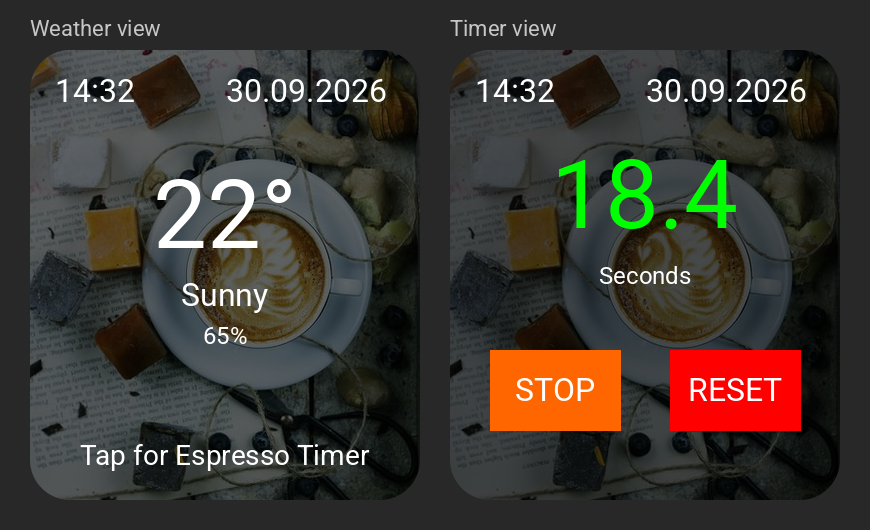

# Espresso Shot Timer for Rocket Appartamento

An ESPHome-based timer for perfect espresso extraction with the Waveshare ESP32-S3 1.8" AMOLED Touch Display.

Discussion and questions: [Home Assistant Community thread](https://community.home-assistant.io/t/espresso-shot-timer-for-the-rocket-appartamento-esphome-lvgl-waveshare-1-8-amoled/1026888)



*Preview (simulation) of the weather view (left) and the timer view while an extraction is running (right).*

## Features

### Timer Mode
- ✅ Touch display to start timer
- ✅ Timer counts forward from 0 seconds (0.1s precision)
- ✅ Drift-free timing based on the system clock (`millis()`), exact across pause/resume
- ✅ **Color transition (configurable via Home Assistant):**
  - 0-24 seconds: **Green** (perfect!)
  - 24-35 seconds: **Green → Yellow → Red** (warning!)
  - 35+ seconds: **Red** (too long!)
- ✅ **STOP/START Toggle Button (orange):** 
  - First click: Pause timer → Button shows "START"
  - Second click: Resume timer → Button shows "STOP"
- ✅ RESET Button (red) to reset and return to weather display
- ⚙️ **Customizable:** Perfect Shot Time and Maximum Shot Time via HA

### Header (weather and timer view)
- 🕐 Current time (hh:mm) at the top left
- 📅 Current date (dd.mm.yyyy) at the top right
- Time comes from Home Assistant (timezone and daylight saving time automatic)
- Shows `--:--` and `--.--.----` until the first time sync

### Idle Mode (no timer)
- 🌡️ Current outdoor temperature (large)
- ☀️ Weather condition from Home Assistant
- 💧 Humidity
- Touch to start timer

### Display Management & Configuration
- 💡 Auto-off after 60 seconds without activity (configurable 0-300s, restarts on every touch)
- 👆 Touch to turn display back on
- ⏱️ Display stays on while timer is running
- 🖼️ Beautiful espresso background image with adjustable transparency
- ⚙️ **Fully configurable via Home Assistant:**
  - Display Brightness (50-255, default: 200)
  - Display Auto-Off Timeout (0-300s, default: 60s)
  - Perfect Shot Time (15-40s, default: 24s)
  - Maximum Shot Time (25-60s, default: 35s)
  - Weather Update Interval (1-60min, default: 5min)
  - Weather View Background Opacity (0-100%, default: 60%)
  - Timer View Background Opacity (0-100%, default: 70%)

## Hardware

**Waveshare ESP32-S3 1.8" AMOLED Touch Display**
- ESP32-S3R8 Dual-Core @ 240MHz
- 1.8" AMOLED Display (368×448 pixels)
- Capacitive Touchscreen (FT5x06)
- WiFi 2.4GHz + Bluetooth 5 LE
- USB-C Port

## Installation

### Requirements
1. [ESPHome installed](https://esphome.io/guides/installing_esphome.html)
2. Home Assistant running
3. USB-C cable

### 1. Configure Secrets

The repository contains a template called `secrets.yaml.example`. **Rename it to `secrets.yaml` and enter your own values:**

```bash
cp secrets.yaml.example secrets.yaml
```

```yaml
wifi_ssid: "YourNetwork"
wifi_password: "YourPassword"
api_key: "GenerateYourOwnKeyWithOpenSSL"   # openssl rand -base64 32
ota_password: "ChooseAnOtaPassword"
ap_password: "ChooseAnApPassword"          # min. 8 characters
```

**Note:** Never commit or share your `secrets.yaml`, it contains your WiFi password and API key.

### 2. Home Assistant Sensors

The weather data on the display comes from Home Assistant. You need three sensors there, for example from the [OpenWeatherMap integration](https://www.home-assistant.io/integrations/openweathermap/) (Settings → Devices & Services → Add Integration).

The firmware expects these entity IDs by default:

| Data | Default entity ID |
|------|-------------------|
| Temperature | `sensor.openweathermap_temperature` |
| Humidity | `sensor.openweathermap_humidity` |
| Weather condition | `sensor.openweathermap_condition` |

Check under Settings → Devices & Services → Entities how your sensors are named. **If the IDs differ, adjust the `entity_id` lines in `espresso-shot-timer.yaml`** (you can also use sensors from another weather integration):

```yaml
sensor:
  - platform: homeassistant
    id: outdoor_temperature
    entity_id: sensor.openweathermap_temperature  # <- your temperature sensor

  - platform: homeassistant
    id: outdoor_humidity
    entity_id: sensor.openweathermap_humidity     # <- your humidity sensor

text_sensor:
  - platform: homeassistant
    id: weather_condition
    entity_id: sensor.openweathermap_condition    # <- your weather condition sensor
```

Without these sensors the weather view has no valid data to show (e.g. `nan°` instead of a temperature). The timer itself does not depend on them.

### 3. Clone Repository

```bash
git clone https://github.com/IamTheLoki/espresso-shot-timer.git
cd espresso-shot-timer
```

Then create your `secrets.yaml` as described in step 1.

### 4. Compile and Flash

```bash
# Connect ESP32 via USB-C
# First flash via USB:
esphome run espresso-shot-timer.yaml

# After first flash: OTA updates possible!
esphome run espresso-shot-timer.yaml --device espresso-shot-timer.local
```

**Build Information:**
- Firmware size: ~1.64 MB (20.2% Flash)
- RAM usage: ~113 KB (33.3%)
- Framework: ESP-IDF 5.5.5
- ESPHome Version: 2026.9.0+
- Compilation successfully tested ✅

### 5. Add to Home Assistant

After first start:
1. Home Assistant → Settings → Devices & Services
2. ESPHome integration should find the device automatically
3. Click "Configure" and enter API key

## Home Assistant Integration

### Sensors Exported to Home Assistant

The ESP32 provides the following sensors that are visible in Home Assistant:

#### Weather Sensors (from Home Assistant)
- **Outdoor Temperature** - Current temperature received from HA OpenWeatherMap
- **Outdoor Humidity** - Current humidity received from HA OpenWeatherMap
- **Weather Condition** - Weather condition text received from HA OpenWeatherMap

#### Configuration Sensors (Read-Only)
- **Display Brightness** - Current brightness setting (50-255)
- **Display Auto-Off** - Current auto-off timeout in seconds (0-300s)
- **Perfect Shot Time** - Current perfect shot time in seconds (15-40s)
- **Maximum Shot Time** - Current maximum shot time in seconds (25-60s)
- **Weather Update Interval** - Current weather update interval in minutes (1-60min)
- **Weather View Background Opacity** - Current weather view background opacity (0-100%)
- **Timer View Background Opacity** - Current timer view background opacity (0-100%)

#### Configurable Parameters (Number Entities)
- **Display Brightness** - Adjust display brightness (50-255, default: 200)
- **Display Auto-Off** - Adjust auto-off timeout (0-300s, default: 60s)
- **Perfect Shot Time** - Adjust perfect shot time (15-40s, default: 24s)
- **Maximum Shot Time** - Adjust maximum shot time (25-60s, default: 35s)
- **Weather Update Interval** - Adjust weather update interval (1-60min, default: 5min)
- **Weather View Background Opacity** - Adjust weather view background opacity (0-100%, default: 60%)
- **Timer View Background Opacity** - Adjust timer view background opacity (0-100%, default: 70%)

#### Control Entities
- **Display** - Light entity to control display on/off state
- **Start Timer** - Button: starts a new run from 0.0s, wakes the display and shows the timer view (ignored while the timer is counting)
- **Stop Timer** - Button: stops (freezes) the timer and shows the result (ignored if the timer is not counting)
- **Reset Timer** - Button: resets the timer and returns to the weather view

#### Timer Sensors
- **Timer Running** - Binary sensor, `on` while the timer is counting (`off` when idle or stopped)
- **Last Shot Time** - Duration of the last shot in seconds, published when the timer is stopped or reset (history and statistics in HA)
- **Display Off In** - Diagnostic sensor, live countdown (1s) in seconds until the display turns off automatically. `0` while the display is off, `unknown` when auto-off is disabled or the timer is running

> **Tip: exclude "Display Off In" from the Recorder.** The sensor updates every second (about 60 state changes per minute), which bloats the Home Assistant database for no benefit. Add it to the `recorder` exclude list in your `configuration.yaml`:
>
> ```yaml
> recorder:
>   exclude:
>     entities:
>       - sensor.espresso_shot_timer_display_off_in
> ```
>
> Adjust the entity ID to your device name (check it under Settings → Devices & Services → Entities). A glob works as well:
>
> ```yaml
> recorder:
>   exclude:
>     entity_globs:
>       - sensor.espresso_shot_timer_display_off_in*
> ```
>
> Restart Home Assistant after changing the `recorder` configuration.

**Benefits:**
- All sensor values appear in Home Assistant Activity Feed
- Historical data tracking for all parameters
- Monitoring of weather data reception from Home Assistant
- Debug logging shows when weather updates are received and processed

## Usage

### Start Timer
- Simply tap the screen (in weather mode)
- Timer starts counting from 0.0 seconds!

### Pause/Resume Timer
- Tap **STOP/START button** (orange)
- On STOP: Timer pauses, button shows "START"
- On START: Timer resumes, button shows "STOP"
- Toggle function allows unlimited pausing and resuming
- Paused time is not counted (elapsed time is calculated from the system clock)

### Control from Home Assistant
- Use the buttons **Start Timer**, **Stop Timer** and **Reset Timer** (e.g. in a dashboard or an automation)
- **Start Timer** always starts a new run from 0.0s (also from a stopped timer), it does not resume
- **Stop Timer** freezes the time, so the result stays visible until you reset
- Use **Timer Running** as a trigger or condition and **Last Shot Time** for history

Example automation action:
```yaml
action: button.press
target:
  entity_id: button.espresso_shot_timer_start_timer
```

### Reset Timer
- Tap **RESET** (red button) → Timer stops completely
- Automatically returns to weather display
- Button text resets to "STOP"

## Customization

### 🎯 Adjust Shot Times (via Home Assistant)

After flashing, you can adjust perfect times directly in Home Assistant:

**In Home Assistant:**
1. Go to: Settings → Devices & Services → ESPHome → Espresso Shot Timer
2. Adjust these parameters:
   - **Perfect Shot Time** (15-40s, default: 24s)
     - Timer is green up to this time
   - **Maximum Shot Time** (25-60s, default: 35s)
     - Timer turns completely red from this time
   - Between shot times: Color gradient from Green → Yellow → Red

**Example Configurations:**
- **Ristretto:** Perfect: 18s, Max: 25s
- **Espresso:** Perfect: 24s, Max: 35s (default)
- **Lungo:** Perfect: 30s, Max: 45s

### 🔆 Adjust Brightness

The display has a default brightness of 200. You can adjust this in Home Assistant:

**In Home Assistant:**
- Go to: Settings → Devices & Services → ESPHome → Espresso Shot Timer
- Change "Display Brightness" (50-255)
- 200 = Default brightness
- 255 = Maximum brightness

**Note:**
- Higher brightness consumes more power
- Minimum brightness is set to 50 for good readability

### 🌤️ Adjust Weather Update Interval

Weather is updated every 5 minutes by default. You can adjust this in Home Assistant:

**In Home Assistant:**
- Go to: Settings → Devices & Services → ESPHome → Espresso Shot Timer
- Change "Weather Update Interval" (1-60 minutes)
- 5 = every 5 minutes (default)

**Note:**
- More frequent updates (e.g. 1min) put more load on Home Assistant
- Longer intervals (e.g. 15min) save resources

### ⏱️ Adjust Display Auto-Off

The display automatically turns off after 60 seconds of inactivity (default). You can adjust this in Home Assistant:

**In Home Assistant:**
- Go to: Settings → Devices & Services → ESPHome → Espresso Shot Timer
- Change "Display Auto-Off" (0-300 seconds)
- 0 = disabled (stays always on)
- 60 = turns off after 60 seconds (default)

**Note:** 
- Display stays on while timer is running
- The countdown restarts on every touch (timeout counts from the last touch)
- A paused timer counts as idle, so the display turns off after the timeout
- Changes to the timeout apply immediately
- Touch display to turn it back on
- In weather display mode, auto-off timeout applies

### 🖼️ Adjust Background Opacity

The background image transparency can be adjusted for both weather and timer views:

**In Home Assistant:**
- Go to: Settings → Devices & Services → ESPHome → Espresso Shot Timer
- Adjust "Weather View Background Opacity" (0-100%, default: 60%)
  - 0% = fully transparent (background image fully visible)
  - 100% = fully opaque (black background, best readability)
- Adjust "Timer View Background Opacity" (0-100%, default: 70%)
  - Higher values improve text readability
  - Lower values show more of the background image

**Note:**
- Changes take effect immediately
- Find the perfect balance between aesthetics and readability

## Troubleshooting

### Touch doesn't respond after reboot
- Known issue with FT5x06 driver
- **Solution:** Flash once more, then it should work

### Display shows nothing
- Check UART log: `esphome logs espresso-shot-timer.yaml`
- Brightness too low? → Set to 255 in Home Assistant

### WiFi doesn't connect
- Check the WiFi settings in your `secrets.yaml`
- Make sure ESP32 is in range
- Fallback hotspot activates after 1 minute
- SSID: "Espresso Shot Timer Hotspot"

### Weather shows no data
- Check entity IDs in Home Assistant
- API connection to HA OK? → Check ESPHome integration

### Font/Character Issues
- ✅ **All text now in English** - no special characters needed
- Basic Latin font glyphs are sufficient
- Emojis removed for compatibility

## Credits

Based on community work:
- [Home Assistant Forum Thread](https://community.home-assistant.io/t/esp32-s3-1-8inch-amoled-touch/956270)
- ESPHome LVGL Documentation
- Waveshare ESP32-S3 Examples

Background image (`espresso_bg.jpg`): ["Latte art and blueberries"](https://commons.wikimedia.org/wiki/File:Latte_art_and_blueberries_(Unsplash).jpg) by Toa Heftiba, cropped and resized. Public domain ([CC0](https://creativecommons.org/publicdomain/zero/1.0/)), via Wikimedia Commons.

## Hardware Pins (Reference)

```
Display (QSPI):
  CLK:  GPIO11
  D0:   GPIO4
  D1:   GPIO5
  D2:   GPIO6
  D3:   GPIO7
  CS:   GPIO12

Touch (I2C):
  SDA:  GPIO15
  SCL:  GPIO14
  INT:  GPIO21
  Addr: 0x38

Boot Button: GPIO0
```

## License

MIT License - Free to use for private and commercial purposes. See [LICENSE](LICENSE) for details.

---

**Enjoy your perfect espresso! ☕**
